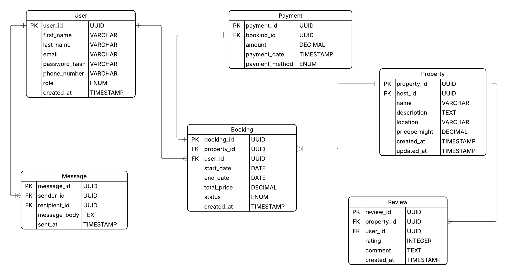

# StayBackend Database Design

## Entities and Attributes

### User

- user_id
- first_name
- last_name
- email
- password_hash
- phone_number
- role
- created_at

### Property

- property_id
- host_id
- name
- description
- location
- pricepernight
- created_at
- updated_at

### Booking

- booking_id
- property_id
- user_id
- start_date
- end_date
- total_price
- status
- created_at

### Payment

- payment_id
- booking_id
- amount
- payment_date
- payment_method

### Review

- review_id
- property_id
- user_id
- rating
- comment
- created_at

### Message

- message_id
- sender_id
- recipient_id
- message_body
- sent_at

## Relationship Between Entities

- One Booking can only be made by one user
- One booking has one payment
- One payment can be made only to one booking
- One property can have many bookings
- One booking belongs to only one property
- One property has many reviews
- One review belongs to one property
- One User can send many messages
- One User can receive many messages
- One Message has one sender (User)
- One Message has one recipient (User)

## ER Diagram

